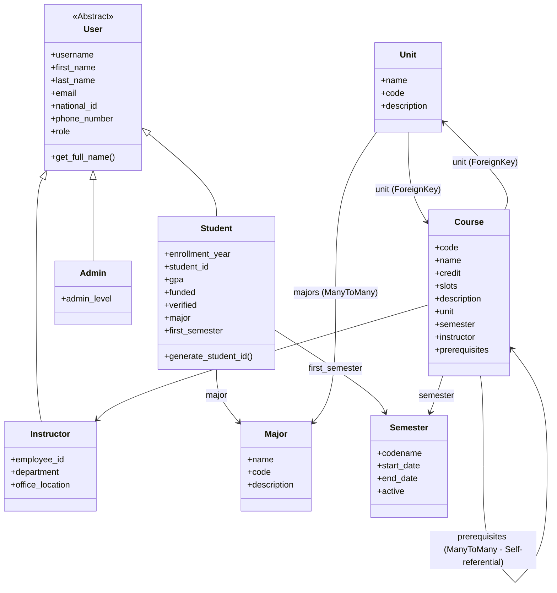
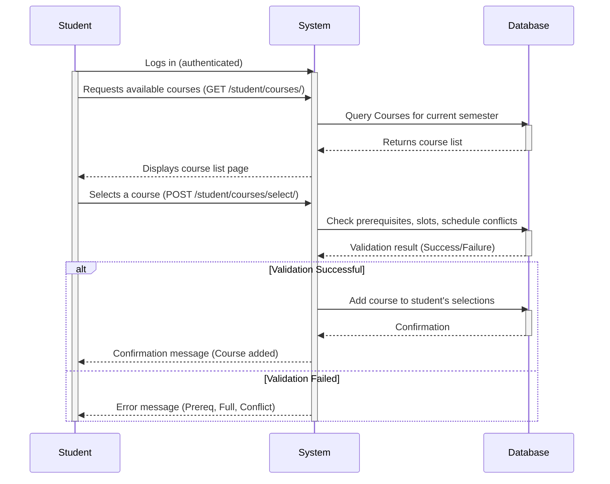

# Student Registration Application (student-reg-ap-project)

This is the student registration web application developed as the final project for the Guilan University Computer Science Advanced Programming Course, tutored by Dr. Tabatabaei. It was created by Behrad Badeli and Sama Zohari.

## Features

*   **User Authentication & Roles:** Registration and login for Students, Instructors, and Admins, each with distinct permissions.
*   **Course Management:**
    *   **Students:** View available courses, select courses based on prerequisites and schedule.
    *   **Instructors:** Manage courses assigned to them (potentially including enrollment lists, grades, etc.).
    *   **Admins:** Create, modify, and delete courses, manage course details (units, prerequisites, instructors, semesters).
*   **Academic Structure Management (Admin):** Create and manage academic units (e.g., departments), courses, and semesters.
*   **Student Information (Admin):** View and manage student details, enrollment status.
*   **Instructor Information (Admin):** View and manage instructor details.

## Technologies Used

*   **Backend:** Python 3.12+, Django 5.2.6+
*   **Frontend:** HTML, Tailwind CSS (via `django-tailwind`), JavaScript (potentially)
*   **Database:** SQLite (default for Django, likely used here), easily configurable to PostgreSQL, MySQL, etc.
*   **Package Management:** `uv` (for fast setup and dependency resolution)
*   **Development Tools:** `django-browser-reload` (for faster development feedback)
*   **Templating:** Django Templates with Tailwind styling.
*   **Dependency Management:** `uv.lock` (managed by `uv`)

## Getting Started (Development Setup)

These instructions will get you a copy of the project up and running on your local machine.

### Prerequisites

*   Python 3.12 or higher installed.
*   `uv` package manager installed (`pip install uv`).

### Installation

1.  **Clone the Repository:**
    ```bash
    git clone https://github.com/your-username/student-reg-ap-project.git
    cd student-reg-ap-project
    ```
    *(Note: Replace `your-username` with the actual repository owner if hosted on GitHub/GitLab/etc.)*

2.  **Create a Virtual Environment (using `uv`):**
    ```bash
    uv venv
    # Activate the virtual environment
    # On Windows:
    .venv\Scripts\activate
    # On macOS/Linux:
    source .venv/bin/activate
    ```

3.  **Install Dependencies:**
    ```bash
    uv sync
    ```
    This command reads the project's dependencies from `pyproject.toml` and `uv.lock` and installs them efficiently within the virtual environment.

4.  **Apply Database Migrations:**
    Create the database schema based on the defined models.
    ```bash
    python manage.py makemigrations # (Optional, if you modified models or are setting up fresh)
    python manage.py migrate
    ```

5.  **Create a Superuser (Admin):**
    To access the Django admin interface, create a superuser account.
    ```bash
    python manage.py createsuperuser
    ```
    Follow the prompts to set a username, email, and password.

6.  **Install and Build Tailwind CSS (django-tailwind setup):**
    This project uses `django-tailwind` for styling. You may need to initialize Tailwind if not already done:
    ```bash
    # Navigate to the theme directory (adjust path if needed)
    cd theme/static_src
    npm install # Install Tailwind and dependencies (requires Node.js/npm)
    cd ../.. # Return to project root

    # Build Tailwind CSS (development mode)
    python manage.py tailwind start
    # Or build for production
    # python manage.py tailwind build
    ```
    *(Note: Running `tailwind start` usually starts a process that watches for changes. You might need to run the Django development server in another terminal.)*

7.  **Start the Development Server:**
    ```bash
    python manage.py runserver
    ```
    Access the application in your web browser at `http://127.0.0.1:8000/`.
    Access the Django admin interface at `http://127.0.0.1:8000/admin/` using the superuser credentials created earlier.

## Project Structure Overview

*   `student_reg_ap_project/`: Main Django project settings and configuration.
*   `accounts/`: Manages user authentication, registration, and profile handling (likely includes `User` model extensions).
*   `courses/`: Core application logic for Units, Courses, Semesters, and potentially student course selections.
*   `admins/`: Views, forms, and templates specifically for Admin user functionalities (managing courses, units, semesters, users).
*   `instructors/`: Views, forms, and templates for Instructor user functionalities.
*   `students/`: Views, forms, and templates for Student user functionalities.
*   `templates/`: Base templates and shared templates used across the application.
*   `theme/`: Contains Tailwind CSS configuration and static files (managed by `django-tailwind`).

## UML Diagrams

### Class Diagram



### (Potential) Sequence Diagram (Student Course Selection Example)

*(This is a simplified example based on inferred functionality)*



## Contributing

Please fork the repository and submit pull requests for any contributions.

## License

This project is licensed under the MIT License - see the [LICENSE](LICENSE) file for details.

