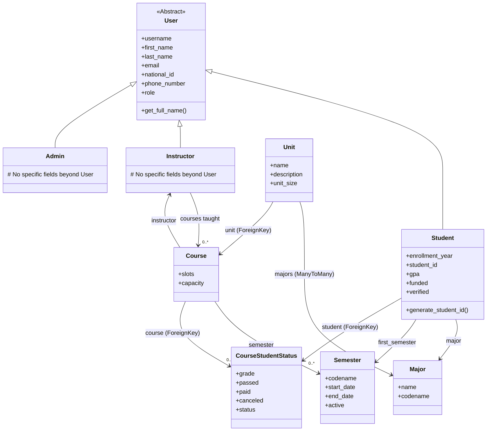

# Student Registration Application (student-reg-ap-project)

This is the student registration web application made as the final project for Guilan CompSci Advanced Programming Course Tutored by Dr. Tabatabaei by Behrad Badeli and Sama Zohari.

## Features

*   User registration and authentication (Student, Instructor, Admin)
*   Course listing and selection for students
*   Course management for instructors
*   Student and course management for admins
*   Responsive UI using Tailwind CSS

## Project Structure

The project is organized into several Django apps:

*   `student_registration`: Main project configuration and base views (home, about).
*   `users`: Handles user models (Custom User, Student, Instructor, Admin), authentication views (login, logout, signup), and basic user management.
*   `courses`: Manages course data, units, semesters, and student enrollment status.
*   `student`: Contains views and logic specific to student actions (view available courses, select courses, check scores).
*   `instructors`: Contains views and logic specific to instructor actions (manage assigned courses).
*   `admins`: Contains views and logic specific to administrator actions (manage students, units, courses, instructors).
*   `theme`: Configures and manages static assets (CSS) using `django-tailwind`.

## Technologies Used

*   **Python**: Primary programming language.
*   **Django**: High-level Python web framework.
*   **Django-Tailwind**: Integrates Tailwind CSS for styling.
*   **Tailwind CSS**: Utility-first CSS framework for rapid UI development.
*   **SQLite**: Default database (configurable).
*   **uv**: Ultra-fast Python package installer and resolver (used for setup).

## UML Diagrams

### Class Diagram



*(Note: Some relationships like TimeSlot and specific form classes are omitted for clarity.)*

## Installation Guide (using `uv`)

These instructions will get you a copy of the project up and running on your local machine.

### Prerequisites

*   **Python 3.12+**: Ensure Python is installed on your system.
*   **uv**: Install `uv`, a fast Python package installer. Follow the instructions on the [official uv GitHub page](https://github.com/astral-sh/uv) or use `pip install uv`.
*   **Node.js & npm**: Required for `django-tailwind`. Download and install from [nodejs.org](https://nodejs.org/).

### Steps

1.  **Clone the Repository:**
    ```bash
    git clone <repository_url> # Replace <repository_url> with the actual URL if hosted
    cd student-reg-ap-project
    ```
    *(If this project was provided as a file dump, assume you are already in the project root directory.)*

2.  **Create a Virtual Environment (using `uv`):**
    `uv` automatically manages a virtual environment, but you can explicitly create and activate one if preferred.
    ```bash
    # uv automatically uses a venv, but you can create one explicitly:
    uv venv
    # Activate the virtual environment (command might vary based on OS)
    # On Linux/macOS:
    source .venv/bin/activate
    # On Windows:
    # .venv\Scripts\Activate.ps1 # (PowerShell) or .venv\Scripts\activate.bat (CMD)
    ```

3.  **Install Dependencies (using `uv`):**
    Use `uv` to install the project dependencies listed in `pyproject.toml` or `uv.lock`.
    ```bash
    uv sync
    ```
    This command reads the project's dependencies and installs them efficiently.

4.  **Apply Database Migrations:**
    Create the database schema based on the defined models.
    ```bash
    python manage.py makemigrations # (Optional, if you modified models or are setting up fresh)
    python manage.py migrate
    ```

5.  **Create a Superuser (Admin):**
    To access the Django admin interface, create a superuser account.
    ```bash
    python manage.py createsuperuser
    ```
    Follow the prompts to set a username, email, and password.

6.  **Install and Build Tailwind CSS (django-tailwind setup):**
    The project uses `django-tailwind` with the `theme` app.
    *   Ensure `NPM_BIN_PATH` in `student_registration/settings.py` points to your `npm` executable. Adjust if necessary (e.g., `/usr/bin/npm`, `C:\\Program Files\\nodejs\\npm.cmd`).
    *   Navigate to the `theme/static_src` directory.
        ```bash
        cd theme/static_src
        ```
    *   Install Node.js dependencies required for Tailwind CSS.
        ```bash
        npm install
        ```
    *   Build the initial Tailwind CSS file.
        ```bash
        npm run build
        ```
        *(Or use `python manage.py tailwind build` from the project root if `django-tailwind` commands are fully set up)*
    *   Return to the project root.
        ```bash
        cd ../..
        ```

7.  **(Optional) Run Tailwind CSS in Development Mode:**
    To automatically rebuild CSS when you change Tailwind classes during development:
    *   In a separate terminal, navigate to `theme/static_src` and run:
        ```bash
        npm run dev
        ```
        *(Or use `python manage.py tailwind start` from the project root)*

8.  **Run the Development Server:**
    Start the Django development server.
    ```bash
    python manage.py runserver
    ```

9.  **Access the Application:**
    Open your web browser and go to `http://127.0.0.1:8000/` to view the application.
    *   Visit `http://127.0.0.1:8000/admin/` to access the Django admin interface using the superuser credentials created in step 5.
    *   Navigate to `/hub/` to access user-specific dashboards after logging in.


## License

This project is licensed under the MIT License - see the `LICENSE` file for details.

---
