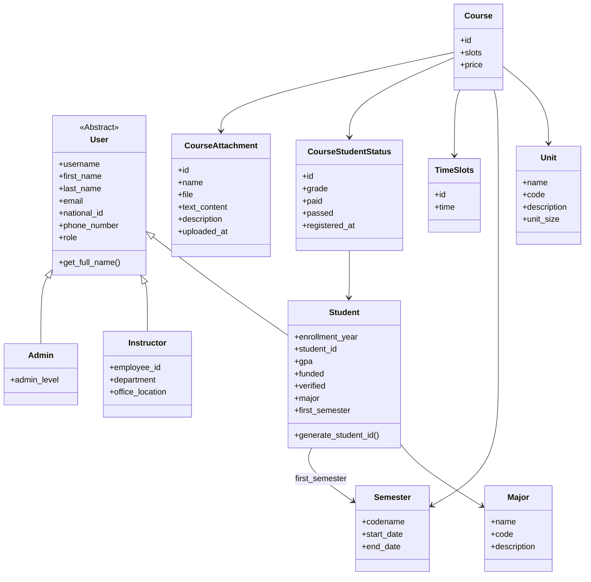
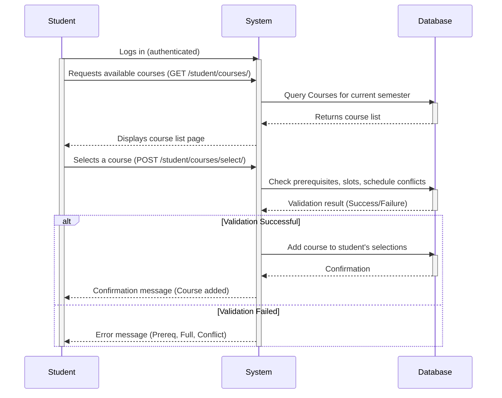

# Student Registration Application (student-reg-ap-project)

This is the student registration web application developed as the final project for the Guilan University Computer Science Advanced Programming Course, tutored by Dr. Tabatabaei. It was created by Behrad Badeli and Sama Zohari.

## Features

*   **User Roles:** Distinct interfaces and permissions for Students, Instructors, and Admins.
*   **Course Management:** Browse available courses, view details, and register for courses.
*   **Student Registration:** Manage student profiles and registration status.
*   **Payment Processing:** Integrated payment panel for course fees.
*   **Admin Panel:** Comprehensive tools for administrators to manage courses, students, instructors, units, and semesters.
*   **Course Attachments:** Upload and access files or text content related to courses.

## Technologies Used

*   **Backend:** Python, Django
*   **Frontend:** HTML, Tailwind CSS (via `django-tailwind`)
*   **Database:** (Likely PostgreSQL or SQLite based on Django defaults, specific DB not mentioned in snippet)
*   **Authentication:** Django's built-in authentication system

## Installation & Setup (General Steps)

1.  **Clone the Repository:**
    ```bash
    git clone https://github.com/your-username/student-reg-ap-project.git
    cd student-reg-ap-project
    ```
2.  **Create a Virtual Environment (Recommended):**
    ```bash
    python -m venv venv
    source venv/bin/activate  # On Windows: venv\Scripts\activate
    ```
3.  **Install Dependencies (using `poetry` or `pip`):**
    *   If using `poetry.lock` (preferred):
        ```bash
        # Ensure poetry is installed: pip install poetry
        poetry install
        ```
    *   If using `requirements.txt` (if available):
        ```bash
        pip install -r requirements.txt
        ```
4.  **Database Setup:**
    *   Apply migrations:
        ```bash
        python manage.py migrate
        ```
    *   (Optional) Load initial data (fixtures).
5.  **Create Superuser (Admin):**
    ```bash
    python manage.py createsuperuser
    ```
6.  **Run the Development Server:**
    ```bash
    python manage.py runserver
    ```
7.  Access the application in your browser (usually `http://127.0.0.1:8000/`).

## Project Structure

```
student-reg-ap-project/
├── admins/           # Admin-specific views, URLs, forms
├── courses/          # Course, Unit, Semester models, views, URLs, forms
├── student_registration/ # Core project settings, main URLs, views
├── templates/        # Base and shared templates
├── theme/            # Tailwind CSS configuration and static files
├── users/            # User models (Student, Instructor, Admin), views, URLs, forms
├── manage.py         # Django management script
├── pyproject.toml    # Poetry dependency management
├── poetry.lock       # Locked Poetry dependencies
├── README.md         # This file
└── ...               # Other standard Django files/folders
```

## UML Diagrams

### Class Diagram

This diagram illustrates the core entities and their relationships within the application.



### Sequence Diagram (Course Selection)

This diagram shows the interaction flow when a student selects a course.



## Contributing

Please fork the repository and submit pull requests for any contributions.

## License

This project is licensed under the MIT License - see the [LICENSE](LICENSE) file for details.

